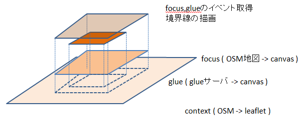

# 概要

<http://gitlab.yamamoto.nitech.ac.jp/murase_masaki/EmmaMurase>
にも同じものがある．

EMMAのクライアント(Javascript)

研究室内から<http://rain2.elcom.nitech.ac.jp:8080/EmmaMuraseAllStroke/>


- 

# 左上のドロップダウンメニューについて
詳しくは<http://rain.elcom.nitech.ac.jp/tsg-wiki/index.php?GlueServerOsm>を参照

| 値             | 説明                                                       |
| -------------- | ---------------------------------------------------------- |
| roadGlueCar    | 自動車が通れそうな道路すべて                               |
| roadGlueAll    | すべての道路                                               |
| strokeGlue     | ストロークを用いて長さの長いいくつかのストローク選択       |
| strokeGlueConn | コネクティビティーを考えたもの                             |
| mitinari       | 小関さんの道なり道路選別手法(主要な道路の選択はしていない) |
| drawGlue_v2    | 村瀬提案手法                                               |

# システム概要


# コードの概要
ドキュメントは/doc/index.htmlを参照

## コーディングルール

* 注意：ES6(ES2015)ではclassを使うことができるので以下のコーディング方法は推奨しない
	* 詳しくは<https://babeljs.io/docs/learn-es2015/>

* 1ファイル1クラスが基本
	* 例：drawMap.jsというファイル名にはDrawMapというクラスがある

* ファイル名はキャメルケース，クラス名はキャピタルケース

* init.jsで各クラスのインスタンスを生成する．

* クラスの書き方
```javascript
function ClassName(){
	//このクラスのコンストラクタの処理
	// var g_className = new ClassName()から呼ばれる.
	
	this.methodName = function(){
		// methodNameメソッドの処理
		// g_className.methodName()から呼ばれる
	}
	this.methodName2 = function(){
		...
	}
}
```

* 初期処理の書き方(HTMLの読み込みが完了したら実行する)
```javascript
$(function(){
	// 初期処理.
});
```

## 処理の概要
### 初期処理（HTML読み込み完了後の処理)
1. globalStaticNumber.js
	* グローバル変数の設定をする
1. init.js
	* グローバル変数の設定と各クラスをインスタンス化する
1. initLeafLetMap.js
	* leafletの初期処理，leafletのイベントハンドラの設定

### イベント処理の注意
イベント処理はLeafletを使ったイベント処理とjQuery,jQueryUIを使ったイベント処理があります.
LeafLetを使ったイベントにはContextのドラッグ，ドロップによる地図の移動，Contextのマウスホイールによる拡大縮小があります．
jQueryを用いたイベントは，Focus,Glueのドラッグ，ドロップによるFoucs位置の移動，
Glue境界におけるGlueの大きさ変更，
Focus,GlueのマウスホイールによるFocusの拡大縮小があります．

WebContent/js/eventのフォルダにはjQuery,jQueryUIを用いたイベント処理を記述しており，
WebContent/js/initLeafletMap.jsにはLeafletを用いた処理を記述しています．

### クラスの概要
ソースコードのコメント参照

# バージョン履歴

## v1_3_0
コンテキストをストロークにした

## v1_2_0
+ ボタンでglue境界の大きさを変えられる

+ glueの内側，外側の境界をドラッグして大きさを変更できる

## v1_1_0
+ focusをOSM地図に変更
+ glue境界で黒丸
+ グローバル変数の追加(glueInnerRadius, glueOuterRadius)


## v1_0_0
* Emmaクライアント作成

	+ focus,contextの拡大縮小
	+ focus+glue,contextの移動

# 各種ソフトウェア
+ Leaflet(<http://leafletjs.com/>)
+ jQuery 2.1.0(<https://jquery.com/>)
	+ jQuery UI 1.11.4(<https://jqueryui.com/>)
	+ jQuery Mousewheel 3.1.13 (<https://github.com/jquery/jquery-mousewheel>)


