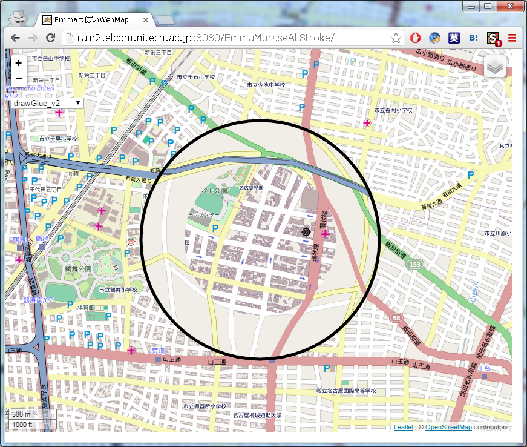

# Description

<http://gitlab.yamamoto.nitech.ac.jp/murase_masaki/EmmaMurase>
にも同じものがある．

EMMAのクライアント(Javascript)

研究室内から<http://murase.elcom.nitech.ac.jp:8080/EmmaMuraseAllStroke/>

- 

# バージョン履歴

## v1_3_0
コンテキストをストロークにした

## v1_2_0
+ ボタンでglue境界の大きさを変えられる

+ glueの内側，外側の境界をドラッグして大きさを変更できる

## v1_1_0
+ focusをOSM地図に変更
+ glue境界で黒丸
+ グローバル変数の追加(glueInnerRadius, glueOuterRadius)

## v1_0_0
* Emmaクライアント作成

	+ focus,contextの拡大縮小
	+ focus+glue,contextの移動

# 各種ソフトウェア
+ Leaflet(<http://leafletjs.com/>)
+ jQuery 2.1.0(<https://jquery.com/>)
	+ jQuery UI 1.11.4(<https://jqueryui.com/>)
	+ jQuery Mousewheel 3.1.13 (<https://github.com/jquery/jquery-mousewheel>)

